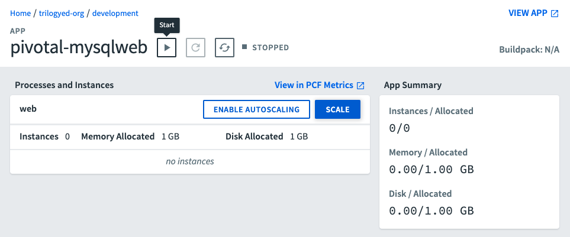
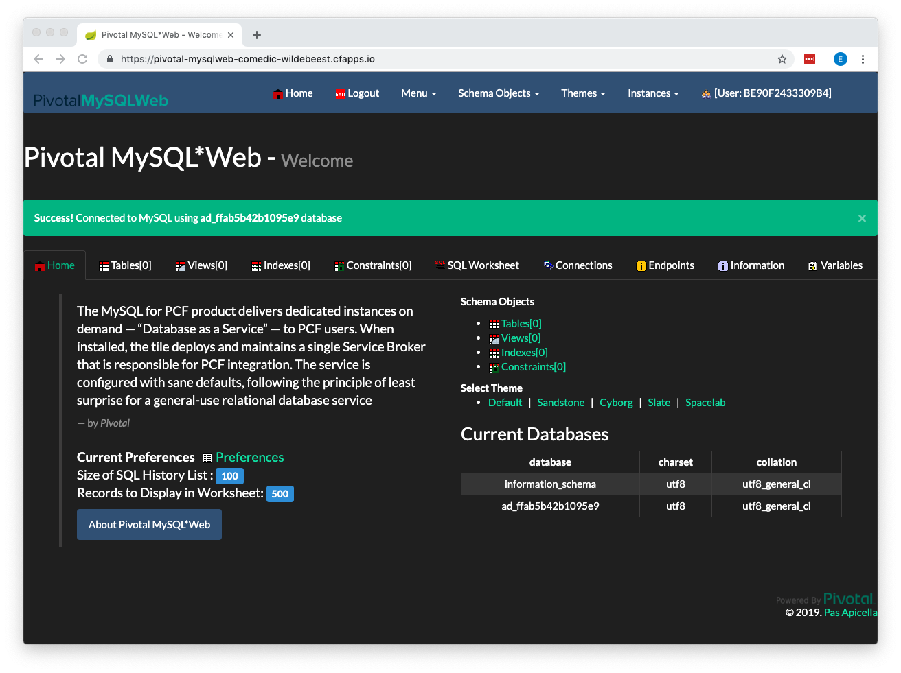
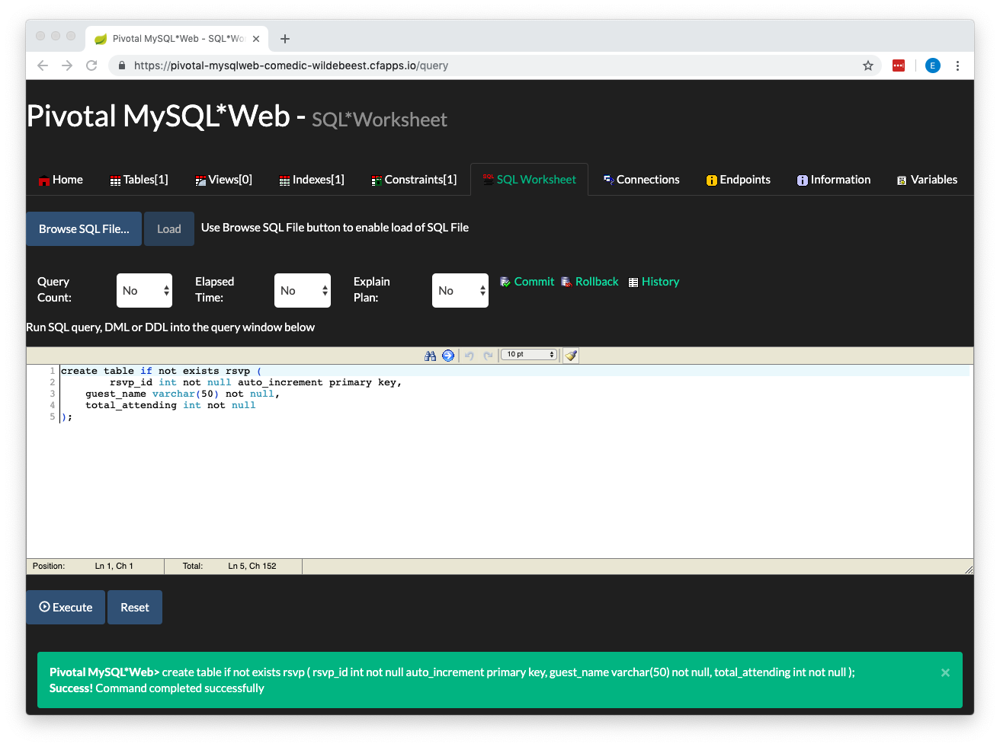
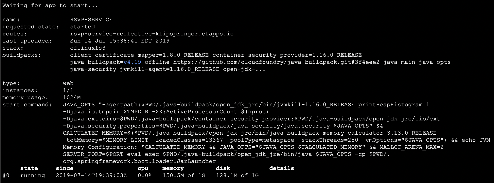
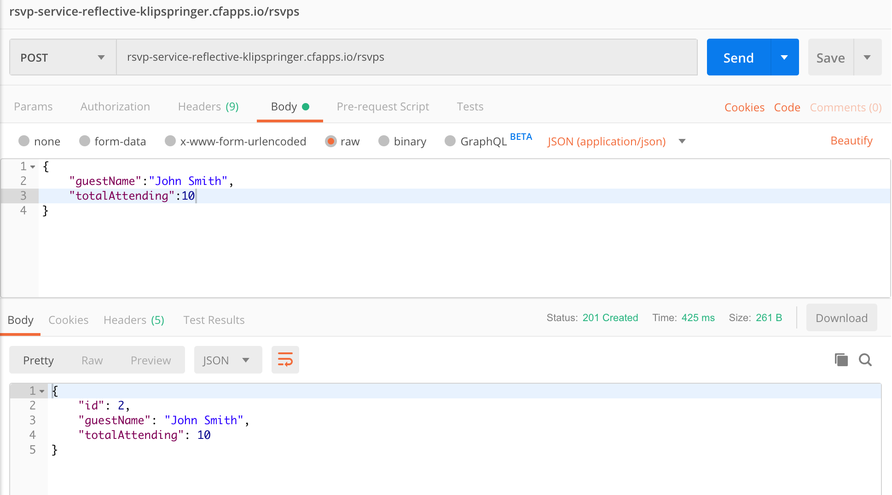
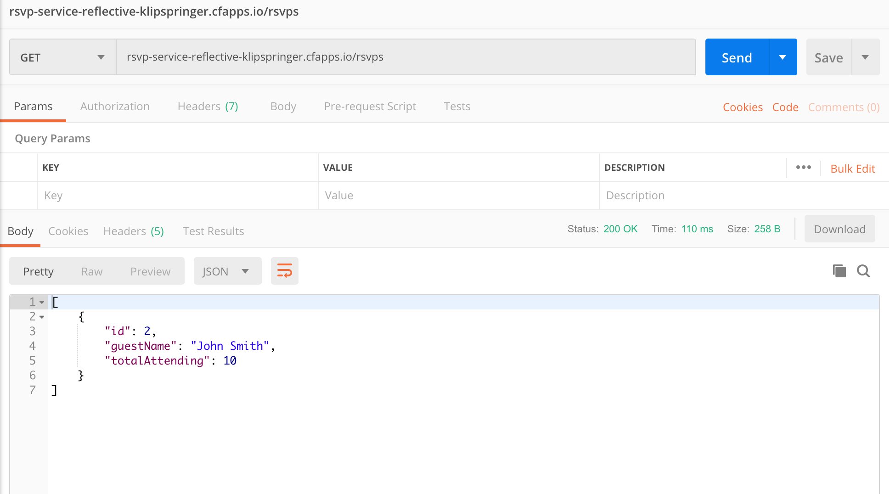
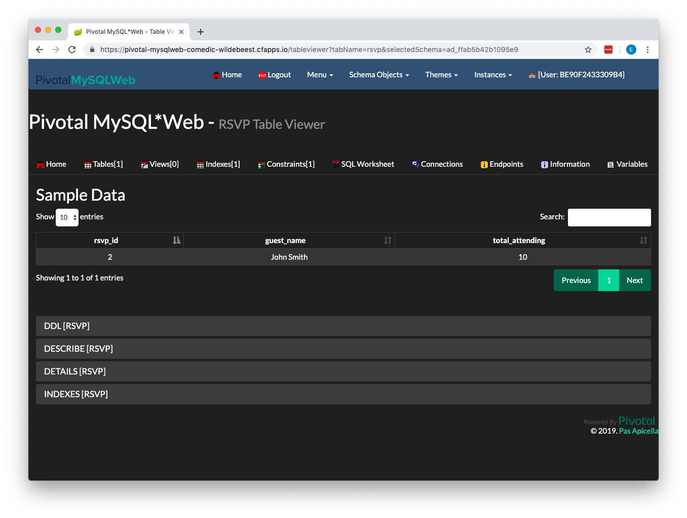

# RSVP Deploy Tutorial

The purpose of this tutorial is to step you through the deployment of a MySQL backed web service on PWS.

You will notice that we don't have to make any changes to our MySQL connections settings when we deploy this service to PWS. The PWS deployment process automatically translates our MySQL database URL credentials during the deployment process.

You will need:

* Internet connection
* Browser
* Terminal/command prompt
* PWS account
* Locally installed PWS CLI tools
* ClearDB MySQL Database (Free Spark DB) installed in PWS account
* Pivotal MySQL Web installed in PWS account
* IntelliJ IDEA Community Edition

## Deploying the System

We'll deploy the RSVP system in the following steps:

1. Start Pivotal MySQL Web
2. Create the RSVP Database
3. Create a manifest file
4. Build and package RSVP system
5. Push RSVP system to PWS
6. Access newly deployed RSVP system

### Step 1: Start Pivotal MySQL Web

We need to start the Pivotal MySQL Web application so we can create the RSVP database.

1. Login to your PWS account and access the Apps Manager
2. Click into your Org
3. Click into your Space (probably called **development**)
4. Click into the **pivotal-mysqlweb** app
5. Click the **Start** button as shown below:



### Step 2: Create RSVP Database

Now we will log into Pivotal MySQL Web and create the RSVP database.

##### 2.1 Login to Pivotal MySQL Web

Click the **VIEW APP** link in the upper right of your screen (see image above) and login with the following credentials:

* Username: admin
* Password: cfmysqlweb

##### 2.2 Access SQL Worksheet

Now click on the **SQL Worksheet** menu item in the center of the screen:



#####2.3 Create Table

Now paste the following create table script into the query window:

```sql
create table if not exists rsvp (
	rsvp_id int not null auto_increment primary key,
    guest_name varchar(50) not null,
    total_attending int not null
);
```

You will see the following screen if your script runs successfully:



### Step 3: Create Manifest File

Next we will create the manifest.yml file for our deployment. Open a terminal or command prompt and navigate to the root of your RSVP project. Create a new file called ```manifest.yml`` in the root of your RSVP project and add the following lines:

```yaml
applications:
- name: RSVP-SERVICE
  memory: 1024M
  instances: 1
  random-route: true
  path: ./target/rsvp-service-0.0.1-SNAPSHOT.jar
  services:
    - MYSQL-SERVICE
```

NOTE: This assumes that your MySQL database service in PWS is called **MYSQL-SERVICE**. Change this entry to match your service's name if you used a different value.

### Step 4: Build and Package RSVP System

Now we will build and package our service so we can push it to PWS.

Switch back to your terminal or command prompt. Make sure you are in the root of your RSVP project. Run the following command to build and package the service:

```./mvnw -DskipTests=true package```

NOTE: If you still have a local version of the RSVP database you don't have to skip the tests.

### Step 5: Push RSVP System to PWS

Now we are ready to push the RSVP service to PWS.

##### 5.1 Login to PWS

We have to login to our PWS account via the CLI tools before we can push our service. Login to your account by running the following command in your terminal or command prompt:

```cf login -a api.run.pivotal.io```

##### 5.2 Push the RSPV Service

Now that you are logged in, push the service using the following command:

```cf push -f manifest.yml```

You should see something similar to the following if you deployment was successful:



### Step 6: Access RSVP System

Now we can exercise the RSVP service. The RSVP service as the following API:

```
Create RSVP
===========
URL: /rsvps
HTTP Method: POST
RequestBody: RSVP data
ResponseBody: RSVP data + ID

Get RSVP
========
URL: /rsvps/{id}
HTTP Method: GET
RequestBody: None
ResponseBody: RSVP data

Get All RSVPs
=============
URL: /rsvps
HTTP Method: GET
RequestBody: None
ResponseBody: Array of RSVP data

Update RSVP
===========
URL: /rsvps/{id}
HTTP Method: PUT
RequestBody: RSVP data
ResponseBody: None

Delete RSVP
===========
URL: /rsvps/{id}
HTTP Method: DELETE
RequestBody: None
ResponseBody: None
```

And each RSVP has the following fields:

```
ID: int
guestName: String
totalAttending: int
```

##### 6.1 Add an RSVP

Now we will add some data to our service. Open Postman, create, and execute the following POST request that creates a new RSVP entry.



NOTE: Substitue the URL for your RSVP service instead of the URL contained in the image.

##### 6.2 Get All RSVPs

Next we'll get all the RSVPs from the service to make sure we see the RSVP we just created. Create and execute the following GET request in Postman:



NOTE: Substitue the URL for your RSVP service instead of the URL contained in the image.

##### 6.3 Look at RSVP Table

Finally, we'll look at the rsvp table using Pivotal MySQL Web. Go back to your Pivotal MySQL Web page and click the **Tables** tab and then clikc on the **rsvp** link in the Tables list. You should see the following:



Congratulations! You successfully deployed your MySQL backed service to PWS!

### IMPORTANT!!! Shut down the RSVP Service AND Pivotal MySQL Web so they don't deplete your PWS credits!!!

